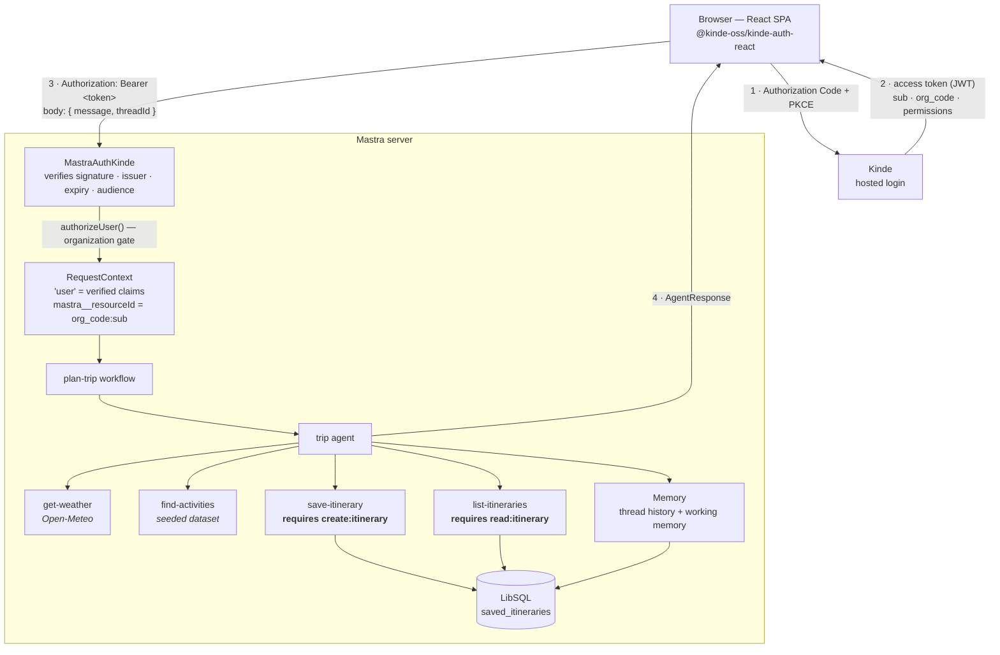

# Plan My Day — a Kinde + Mastra starter kit

Plan My Day is a working example of an AI agent that knows which user is asking, which organization that user belongs to, and which actions that user is allowed to perform. It uses [Kinde](https://kinde.com) for identity and [Mastra](https://mastra.ai) for the agent runtime, connected by the [`@kinde-oss/mastra-auth-kinde`](https://github.com/kinde-oss/mastra-auth-kinde) provider.

When you ask the agent to plan an afternoon, it reads the weather forecast, selects activities, and returns a structured itinerary. When you then ask it to save that itinerary, the outcome depends on the permissions in your Kinde access token. A user who holds `create:itinerary` saves the plan. A user who does not hold that permission receives a clear refusal. The prompt is identical in both cases, and only the authenticated identity differs.

## What this starter kit demonstrates

| Concern | Implementation |
|---|---|
| Authentication | Kinde SPA using Authorization Code with PKCE, a bearer token, and `MastraAuthKinde` verification of signature, issuer, expiry, and audience |
| Organization identity | The `org_code` claim, with an optional allow-list through `allowedOrgCodes` |
| Authorization | The `permissions` claim, checked inside the backend tools |
| Data isolation | A resource ID derived on the server from `org_code` and `sub` |
| Memory | Thread-scoped conversation history and resource-scoped working memory, stored in LibSQL |
| Persistence | Saved itineraries in LibSQL, with ownership fields written from the verified token |
| Agent | One agent with four tools and multi-step tool calling |
| Structured output | A discriminated-union response envelope that the frontend renders directly |
| Workflow | A typed `plan-trip` workflow that acts as the entry point |
| Frontend | A React and Vite single-page application |

### The identity model

The security model follows from a single derivation:

```
org_code + sub  →  server-derived resource ID  →  memory and persistence isolation
```

The provider's `mapUserToResourceId` hook produces the resource ID from the verified token. The browser cannot supply or influence this value.

## Architecture



The browser sends only a message and a thread ID. It does not send `sub`, `org_code`, `resourceId`, or permissions, and the server ignores those fields if a client supplies them. Four mechanisms enforce this:

- Tool input schemas contain no identity fields, so Zod strips unknown keys before `execute` runs.
- Mastra removes reserved keys, including `mastra__resourceId`, from any client-supplied request context.
- Each tool reads identity from the request context rather than from its arguments.
- Each database read is scoped with `WHERE org_code = ? AND sub = ?`.

Authorization runs at the tool boundary rather than at the route boundary. An HTTP request carries no tool name, so a route-level check cannot determine which action the caller intends to perform. The tool that performs the action has that information and applies the check.

## Features

### Authentication

The frontend is a public SPA that uses Authorization Code with PKCE through `@kinde-oss/kinde-auth-react`. This application type has no client secret, because a browser cannot store one securely, and the starter kit never asks for one.

The frontend sends the access token to the Mastra server in an `Authorization: Bearer <token>` header. `MastraAuthKinde` verifies the token against the JWKS endpoint of your Kinde tenant and checks the signature, the issuer, the expiry, and the audience. This repository contains no token verification logic of its own, because the provider supplies it.

The server returns `401` for requests that present no token, a malformed token, an expired token, a token from another issuer, or a token for another audience.

### Authorization

The starter kit defines two permissions in [`src/mastra/lib/kinde.ts`](src/mastra/lib/kinde.ts):

| Permission | Required by |
|---|---|
| `read:itinerary` | `list-itineraries` |
| `create:itinerary` | `save-itinerary` |

The permission checks run on the server, inside the tools. They fail closed: the code treats an absent or malformed `permissions` claim as an empty permission set, so a misconfigured tenant denies access rather than granting it.

The frontend applies no authorization policy. It reads a `permissionDenied` flag that the backend sets and selects a presentation for it. All policy remains on the server.

A refused action returns structured data rather than raising an exception. A denied save is an expected outcome that the model explains to the user and the interface renders, so it does not interrupt the run.

### Isolation

- The resource ID is `org_code:sub`, derived from the verified token.
- The server writes `sub`, `org_code`, and `resourceId` onto each saved itinerary.
- Every read filters on both `org_code` and `sub`.
- Users in the same organization cannot read each other's saved itineraries. This behavior was verified against a live Kinde tenant with two real users.
- The same person signed in to two organizations receives two independent sets of saved itineraries and two independent memories.

> Cross-organization isolation is covered by the automated test suite. It has not been verified against a live tenant, because the available test users belonged to the same organization.

### Memory

Memory is configured in [`src/mastra/memory.ts`](src/mastra/memory.ts) and has two layers:

- **Conversation history** holds the last 20 messages and is scoped to a thread.
- **Working memory** holds travel preferences and is scoped to the resource, so preferences apply across every conversation that the same user starts. A preference such as "I am vegetarian" therefore affects plans generated in later sessions.

The working memory schema is a closed set of fields with no free-text entry, which limits what the agent can record to trip-planning facts:

```
dietary · likes · dislikes · preferredStartTime · pace · accessibility
```

The frontend supplies the `threadId` and generates a new one when the user starts a new conversation. The frontend never supplies the resource ID, because Mastra derives it from the token through `mapUserToResourceId`. A browser can therefore select its own conversation but cannot select whose memory it reads.

### Weather

[`get-weather`](src/mastra/tools/get-weather.ts) uses the Open-Meteo geocoding and daily forecast endpoints, which require no API key and no account. The tool resolves a place name to coordinates, requests the forecast with `timezone=auto` so that dates refer to the local day at the destination, and returns a small stable output shape.

The tool reports failures explicitly instead of returning substitute data. An unknown place, a date outside the available forecast range, an upstream error, and a request timeout each produce a distinct typed error.

### Activities

[`find-activities`](src/mastra/tools/find-activities.ts) searches a curated dataset that ships with this repository. The dataset contains 24 activities across Lagos (12), Lisbon (6), and Cape Town (6), and covers all eight categories: `outdoor`, `indoor`, `food`, `culture`, `nature`, `nightlife`, `shopping`, and `wellness`.

The starter kit uses local data rather than an external places API, which removes the need for an additional API key or quota during setup. To use a different source, replace the dataset with a database query or an API call. The tool contract stays the same.

Ranking is deterministic, so the same query always returns the same results in the same order. Ranking also accounts for weather: when you pass the forecast from `get-weather`, the tool lowers the rank of weather-sensitive activities and marks each result with a `weatherFit` value, which lets the agent explain the trade-off. Such activities remain in the results, so the agent can still select one when the user asks for it.

### Persistence

Saved itineraries are stored in LibSQL, in the `saved_itineraries` table. Each record wraps the itinerary in metadata that the server owns:

```
id · itinerary · sub · orgCode · resourceId · createdAt · updatedAt
```

The `itinerary` field holds the agent-facing `ItinerarySchema` object. The server writes the ownership fields, which never originate from the model or from the client.

#### Database location

The default database is `mastra.db` in the project root. The path resolves from the project root rather than from the current working directory.

This distinction is important. A relative path such as `file:./mastra.db` resolves against the directory in which the process starts, and `mastra dev` runs its bundled server from a different directory than `npm test` uses. That behavior placed the database in unexpected locations and caused `npm run dev` and `npm test` to use different files. [`src/mastra/lib/database-url.ts`](src/mastra/lib/database-url.ts) resolves the path from the project root and removes the inconsistency.

Set `DATABASE_URL` to override the location. The value passes through unchanged:

```env
DATABASE_URL=file:/absolute/path/to/mastra.db   # explicit local file
DATABASE_URL=libsql://your-db.turso.io          # hosted Turso database
```

Do not set a relative path such as `file:./mastra.db`, because that reintroduces the working-directory dependency.

### Model access

The agent needs an OpenAI API key, and the starter kit accepts one from either of two sources.

**A key that the user supplies.** Sign in, open the **AI: OpenAI** control in the header, and enter a key. The application keeps that key in memory for the current page session and sends it with each planning request. Bring your own OpenAI API key so that the demo does not require the project maintainer to provide model access, and so that model usage is charged to your own OpenAI account.

**A key that the server provides.** Set `OPENAI_API_KEY` in the server environment. This suits a private or self-hosted deployment. The value is never sent to the browser.

A key supplied by a user takes precedence over the server key, so a shared deployment does not spend the maintainer's quota when the caller brought their own. When neither source provides a key, the application reports that a key is required and does not attempt a model call.

The user-supplied key travels in a request header, and the server holds it in `AsyncLocalStorage` for the duration of that request. It therefore stays out of the workflow input schema, workflow state, workflow traces, working memory, and the database. The application does not write the key to `localStorage`, `sessionStorage`, a cookie, or the URL, does not log it, and does not return it in any API response. The `/me` endpoint reports only which source a request would use, never the key itself.

Model usage is charged by OpenAI to the account that owns the key. The starter kit does not make the model calls free.

## Prerequisites

- Node.js 22.13.0 or later, as declared in the `engines` field of `package.json`.
- npm. The repository includes `package-lock.json`; pnpm and yarn are untested.
- A Kinde account. The free tier is sufficient.
- An OpenAI API key. You can enter it in the application at run time, or set `OPENAI_API_KEY` on the server. See [Model access](#model-access). The agent uses the `openai/gpt-4.1-mini` model through the Mastra model gateway.

The starter kit requires no separate database installation and no weather API key.

## Configure Kinde

The setup requires one application, one API, one organization, two permissions, and two users.

> Kinde updates its dashboard wording from time to time. The following steps describe what to create. The exact menu labels in your dashboard can differ.

### 1. Create the application

Create a **Front-end and mobile** application, which is the SPA application type, for the React and Vite frontend. Copy the **Client ID** and use it as `VITE_KINDE_CLIENT_ID`.

This application type has no client secret, and the starter kit never requires one.

### 2. Set the callback and logout URLs

Set both URLs to the origin of the frontend:

```
Allowed callback URL:          http://localhost:5173
Allowed logout redirect URL:   http://localhost:5173
```

> This starter kit does not implement an `/api/auth/...` callback route. The Kinde React SDK completes the PKCE redirect in the browser and returns to the application origin. [`src/app/env.ts`](src/app/env.ts) defaults both URLs to `window.location.origin`, so register the deployed origin as well when you host the frontend elsewhere.

### 3. Register an API and authorize the application

Create an API and give it an identifier such as `plan-my-day-api`. Then authorize the front-end application to request tokens for that API.

Use the same identifier for both `KINDE_AUDIENCE` on the server and `VITE_KINDE_AUDIENCE` in the frontend. The frontend requests a token for that audience, and the server requires the token to carry it, so the two values must match.

> Complete this step before you start the application. A Kinde token issued without an API audience carries an empty `aud` claim, and the server rejects such a token when `KINDE_AUDIENCE` is set.

### 4. Enable organizations

Configure your users to sign in to an organization so that their tokens carry an `org_code` claim. Record the organization code, which has the form `org_...`.

### 5. Create the permissions

Create these two permissions:

```
read:itinerary
create:itinerary
```

Assign them to users within the organization rather than only at the account level. You can assign them directly or through a role. For example, a *Planner* role can hold both permissions and a *Viewer* role can hold only `read:itinerary`. The starter kit reads the `permissions` claim and does not read roles, so either assignment method works.

### 6. Create two test users

The two users demonstrate the difference that permissions make:

| User | Permissions | Expected behavior |
|---|---|---|
| Planner | `read:itinerary`, `create:itinerary` | Plans, saves, and lists itineraries |
| Viewer | `read:itinerary` | Plans and lists itineraries; the save operation is denied |

### 7. Confirm that the claims arrive

Sign in and check the header and the permission indicators in the application, or call `GET /me` with the access token. The endpoint returns the values that the server derived, including `sub`, `orgCode`, `permissions`, and `resourceId`, together with a `claimWarnings` array that names any missing claim. If `org_code` or `permissions` are absent, this endpoint reports the problem directly.

## Environment variables

Copy the example file and complete it:

```bash
cp .env.example .env
```

### Required

| Variable | Used by | Description |
|---|---|---|
| `KINDE_DOMAIN` | Mastra server | The tenant URL. The value must include the `https://` scheme, and the provider throws an error if the variable is absent. |
| `VITE_KINDE_DOMAIN` | Frontend | The same tenant URL. |
| `VITE_KINDE_CLIENT_ID` | Frontend | The Client ID of the SPA application. |
| `KINDE_AUDIENCE` | Mastra server | The API identifier that you created for the Plan My Day API. The server requires each token to carry this value in its `aud` claim. |
| `VITE_KINDE_AUDIENCE` | Frontend | The same API identifier. The frontend requests a token for this audience, so the value must match `KINDE_AUDIENCE`. |

> `OPENAI_API_KEY` is optional. See [Model access](#model-access).

> The provider enforces the audience only when `KINDE_AUDIENCE` holds a value, so the code also runs with both audience variables empty. The recommended configuration for this starter kit sets them, because an API audience makes the access token an API token for your backend. If you leave them empty, complete step 3 of the Kinde setup first and then set both values together.

### Optional

Each of the following variables has a working default.

| Variable | Default | Description |
|---|---|---|
| `OPENAI_API_KEY` | Not set | A server-provided OpenAI key. When it is absent, each user supplies their own key in the app. A user-supplied key always takes precedence. The value is never sent to the browser. |
| `DATABASE_URL` | `mastra.db` in the project root | An absolute `file:` path or a `libsql://` URL. |
| `KINDE_ALLOWED_ORG_CODES` | All organizations allowed | A comma-separated allow-list of organization codes. The server returns `403` for other organizations. |
| `KINDE_DEBUG` | Disabled | Set to `true` to log token verification failures. The log contains the error message only and never the token. |
| `APP_ORIGIN` | `http://localhost:5173` | The CORS origin, or a comma-separated list of origins, that the Mastra server accepts. |
| `VITE_KINDE_REDIRECT_URI` | The application origin | The redirect target after sign-in. |
| `VITE_KINDE_LOGOUT_URI` | The application origin | The redirect target after sign-out. |
| `VITE_MASTRA_URL` | `http://localhost:4111` | The address of the Mastra server. |

### Example `.env`

The following values are placeholders. Do not commit real credentials. The `.env` file is listed in `.gitignore`.

```env
KINDE_DOMAIN=https://your-domain.kinde.com
VITE_KINDE_DOMAIN=https://your-domain.kinde.com
VITE_KINDE_CLIENT_ID=your-client-id
KINDE_AUDIENCE=your-api-audience
VITE_KINDE_AUDIENCE=your-api-audience
OPENAI_API_KEY=your-openai-key   # optional; see Model access
```

## Run the starter kit

```bash
git clone https://github.com/kinde-starter-kits/mastra-starter-kit
cd mastra-starter-kit
npm install
cp .env.example .env   # then complete the file
```

> `npm install` installs `@kinde-oss/mastra-auth-kinde` from GitHub rather than from npm, and builds it through the package's `prepare` script.

Start the two processes in separate terminals:

```bash
npm run dev:mastra   # Mastra server at http://localhost:4111
npm run dev:app      # React SPA at http://localhost:5173
```

Then open <http://localhost:5173> and sign in.

> Mastra Studio at `http://localhost:4111` applies the same bearer-token check as the API, because `server.auth` is configured. The provider handles API authentication and does not provide the Studio login interface, so use the SPA to run the demonstration.

## Run the demonstration

Sign in as the Planner user and send the following request:

> Plan me an afternoon in Lagos tomorrow. I like outdoor activities and don't want anything too early.

The agent resolves the relative date against the current date, calls `get-weather` for Lagos, passes the forecast to `find-activities`, selects activities that fit an afternoon, and returns a structured itinerary that the frontend renders as a card.

Then send:

> Save this itinerary.

The agent calls `save-itinerary`, the tool stores the record, and the interface confirms the result.

Now sign in as the Viewer user and repeat both requests. The agent still produces an itinerary. The save operation is denied, the interface displays a permission-denied state that names `create:itinerary`, and the server writes no record. When you ask the Viewer to list saved itineraries, the response contains only itineraries that the Viewer saved, and it does not include the record that the Planner saved.

## HTTP API

The frontend calls two endpoints on the Mastra server. Both require a valid bearer token.

| Method | Path | Purpose |
|---|---|---|
| `GET` | `/me` | Returns the identity that the server derived from the token, including `sub`, `orgCode`, `permissions`, `resourceId`, and `claimWarnings`. |
| `POST` | `/api/workflows/planTripWorkflow/start-async` | Runs the `plan-trip` workflow to completion and returns an `AgentResponse`. The request body is `{ "inputData": { "message": "...", "threadId": "..." } }`. |

## Response contract

Every agent reply takes one of three shapes, defined in [`src/mastra/schemas/agent-response.ts`](src/mastra/schemas/agent-response.ts):

```ts
{ kind: 'itinerary',  itinerary: Itinerary }
{ kind: 'saved-list', itineraries: SavedItinerary[] }
{ kind: 'message',    message: string,
                      permissionDenied: boolean,
                      requiredPermission: string | null }
```

A single itinerary schema cannot represent a list of saved plans or a refusal, so the envelope carries a `kind` discriminator and only the payload that matches it. The frontend switches on `kind` and reads the `permissionDenied` flag, so it never inspects message text to determine authorization state.

## Project layout

```
src/
  mastra/
    index.ts                 Mastra instance: auth, storage, CORS, /me route
    storage.ts               Shared LibSQL client
    memory.ts                Memory configuration and travel preference schema
    agents/trip-agent.ts     Agent instructions, four tools, structured output
    tools/
      get-weather.ts         Open-Meteo forecast lookup
      find-activities.ts     Seeded dataset and deterministic ranking
      save-itinerary.ts      Requires create:itinerary
      list-itineraries.ts    Requires read:itinerary
    workflows/plan-trip.ts   Typed workflow entry point
    schemas/                 itinerary, saved-itinerary, agent-response
    lib/                     kinde identity and permissions, itinerary-store, database-url
  app/                       React SPA
tests/                       264 tests
```

## Tests

```bash
npm test         # 264 tests across 14 files
npm run typecheck
npm run lint
```

The test suite requires no Kinde account, no OpenAI key, and no network access. It generates an RSA key pair, serves a JWKS document, and mints signed tokens, so the provider performs real signature verification. Open-Meteo responses are stubbed at the `fetch` boundary and the model is scripted turn by turn, which leaves the tools, the database, the agent, and the authentication pipeline running as they do in production.

The suite verifies the following behavior, among other cases:

- The server rejects malformed, expired, forged, wrong-issuer, and wrong-audience tokens.
- The resource ID equals `org_code:sub` and a client cannot override it.
- An absent `permissions` claim fails closed.
- A save without `create:itinerary` is refused and writes no record.
- One user cannot read another user's itineraries, in the same organization or in a different organization.
- The weather forecast affects activity selection.

## Deploy

Build both parts with a single command:

```bash
npm run build      # runs "mastra build --dir src/mastra" and then "vite build"
```

The frontend build produces static files that you can host on any static host. The Mastra server runs as a Node service. For a deployment, set the same server-side environment variables, set `DATABASE_URL` to a hosted LibSQL or Turso database instead of a local file, set `APP_ORIGIN` to the origin of the deployed frontend, and register that origin in Kinde as a callback URL and a logout redirect URL.

## Adapt the starter kit

- **Use real activity data.** Replace the dataset in `find-activities.ts`. The tool contract does not change.
- **Add permissions.** Add entries to `PERMISSIONS` in `lib/kinde.ts` and check them inside the tool that performs the action.
- **Change the model.** Update `TRIP_AGENT_MODEL` in `agents/trip-agent.ts` and set the API key for the provider you select.
- **Restrict organizations.** Set `KINDE_ALLOWED_ORG_CODES` to a comma-separated list of organization codes.

## License

MIT. See [LICENSE](LICENSE).
